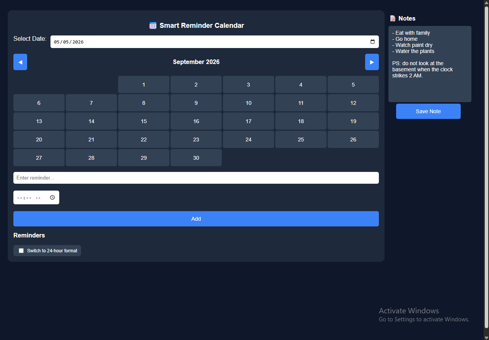

# Smart Reminder Calendar App

A simple but powerful web-based calendar and reminder system built using **HTML, CSS, and JavaScript**.  
It allows users to schedule reminders, add daily notes, and receive browser notifications — all stored locally in the browser.

REMINDER: The site works perfectly in pc but due to strict limitations on mobile phones and possibly tablets, notifications WON'T work on them.

Date of Creation: May 5, 2026
---
## Features

- Interactive monthly calendar view  
- Add time-based reminders per date  
- Browser notifications for reminders  
- Daily notes per calendar date  
- 12-hour / 24-hour time format toggle  
- Local storage (data persists even after refresh)  
- Mobile-responsive design  
- Automatic sorting of reminders by time  
---
## Tech Stack

- HTML5  
- CSS3 (Flexbox + Responsive Design)  
- Vanilla JavaScript  
- LocalStorage API  
- Browser Notifications API  
---
## Screenshots

---
## What I Learned

This project helped me improve my understanding of:

- DOM manipulation in JavaScript  
- Working with dates and time logic  
- Storing and retrieving data using LocalStorage  
- Building responsive layouts  
- Creating interactive UI components  
- Managing state in a vanilla JavaScript application  

---
## Possible Future Improvements

- Cloud sync for reminders  
- Drag-and-drop scheduling  
- Recurring reminders  
- Dark/Light mode toggle  
- PWA installable version improvements  
---
## Author

Built by a self-taught developer, jinn-31 ,learning through hands-on JavaScript projects.
---
## Note
This project is part of a personal learning portfolio focused on building real-world frontend applications.
---
